# GaussMorph: Mesh-Guided Gaussian Splatting for Object Deformation and Texture Editing
**Team members**: Zishan Wang, Zeyu Deng, Jack Wang, Owen Zou

## Abstract
In computer vision, creating 3D scenes that are both editable and capable of efficient rendering remains a formidable challenge. Explicit 3D Gaussian Splatting representations significantly boost rendering performance and open up new possibilities for scene editing, yet existing methods typically handle either geometric deformation or texture modification—not both within a single framework. Moreover, mesh‑based approaches to joint geometry and texture editing lack the expressive power needed to model high‑frequency details such as hair with precision.To overcome these limitations, we propose a mesh‑guided explicit Gaussian representation framework that preserves Gaussian rendering efficiency and editing flexibility while decoupling—and then collaboratively editing—geometry and texture. We place Gaussians directly on the mesh surface for fine‑grained geometric modeling, and we leverage xatlas to unfold the mesh into a global UV atlas for flexible texture editing. By separating geometric and appearance attributes in the Gaussian representation, our method supports both independent edits of geometry or texture and their synchronized adjustment within the same unified system.

## Technical approach
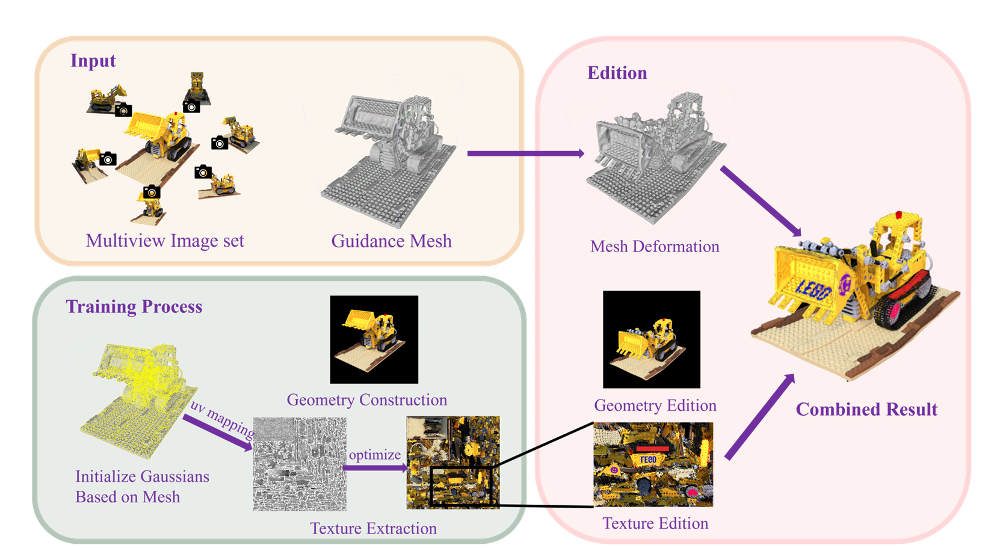

Using multi‑view images, we generate Gaussians guided by an explicit mesh and unfold that mesh into a UV atlas with xatlas for joint texture optimization. Having implemented mesh‑driven deformation, we will next add texture editing and integrate both modes.

we split training into two stages:

1. **Geometry‐only stage**  
   Fit the geometry using the traditional Gaussian rendering pipeline.  
2. **Texture‐rendering stage**  
   Render textures using the TextureGS approach.

Our experiments show that attempting to train geometry and texture simultaneously leads to some Gaussians misaligning with the surface and producing blurred renders. The two‐stage strategy decouples geometry fitting from texture learning, resulting in a more precise geometric reconstruction.

### Geometry construction
First, given a set of multi-view images, we introduce an explicit mesh as a topological guide and adopt a mesh-based Gaussian distribution learning strategy. During training, we constrain each Gaussian’s parameters and growth to ensure that it remains tightly bound to its associated triangle—its position being jointly determined by the three vertex coordinates of that triangle and its centroid—thus performing precise geometric modeling.

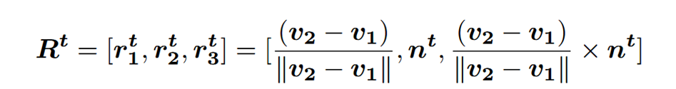

Like the definition in Mani-GS[1], for each triangle, we define its local coordinate frame $R^t$, We choose one edge of the triangle and take the unit vector along that edge (with orientation) as the first axis; we take the triangle’s unit normal $n^t$ as the second axis; and we define the third axis as the cross-product of the first two axes. We then relate local Gaussian parameters ($R^l, s^l, μ^l$) to the global frame by

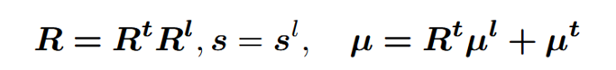

where $μ^t$ is the triangle’s centroid. In other words, the global rotation $R$ is obtained by premultiplying the Gaussian’s local rotation $R^l$ by the triangle’s local frame $R^t$; the global scale $s$ equals the local scale $s^l$; and the global $μ$ is the rotated local mean plus the triangle center.

### Texture Extraction
Using `xatlas` to unwrap the mesh onto a square texture atlas, we obtain vertex UV mappings. Based on barycentric coordinates, we compute each Gaussian’s UV coordinates.

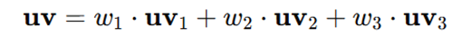

By modeling the gradient of UV with respect to the Gaussian’s global coordinate $\mu$, we fill in texture information for regions not covered by UV.

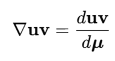

Then, we perform joint optimization between the Gaussian parameters and the texture atlas to complete texture extraction.

We adapt the texture‐rendering scheme from TextureGS[2] to model texture information in regions without UV mapping, but replace TextureGS’s cube‐layout atlas with a square texture map. Unlike TextureGS, which can only model textures for objects with spherical topology, fails to fit reasonable textures on fine geometric details, and even distorts geometry when edited and re‐rendered as Gaussians, our method supports arbitrary topologies, captures fine geometric detail, and preserves the original geometry when mapping back to Gaussians.

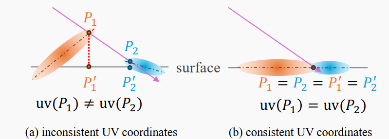

During the extraction period, a ray may intersect with different Gaussians and generate intersections corresponding to different UV coordinates, propagating the same pixel gradient to multiple locations on the texture image, thereby generating blurred texture images. To address this problem, we propose to constrain the centers of Gaussians to lie on the mesh surface, with their rotations aligned to the surface normals.

### Edition
In the interactive stage, the framework leverages the binding between Gaussians and the mesh to propagate user‐driven mesh deformations and texture edits into the Gaussian parameters, enabling real‐time scene editing and rendering. The parameters affected by mesh deformation include $R$, $μ$, and $∇uv$.

### Loss Design
We introduce a rotation loss $L_r$ to encourage each Gaussian to adhere closely to the surface, thereby preserving UV continuity.
Also we use scale loss $L_s$ to constrain Gaussian size, ensuring that when deformations occur and Gaussians move with the mesh, they cannot grow so large as to cause blurring.  

## Results
### Reconstruction and Texture Extraction

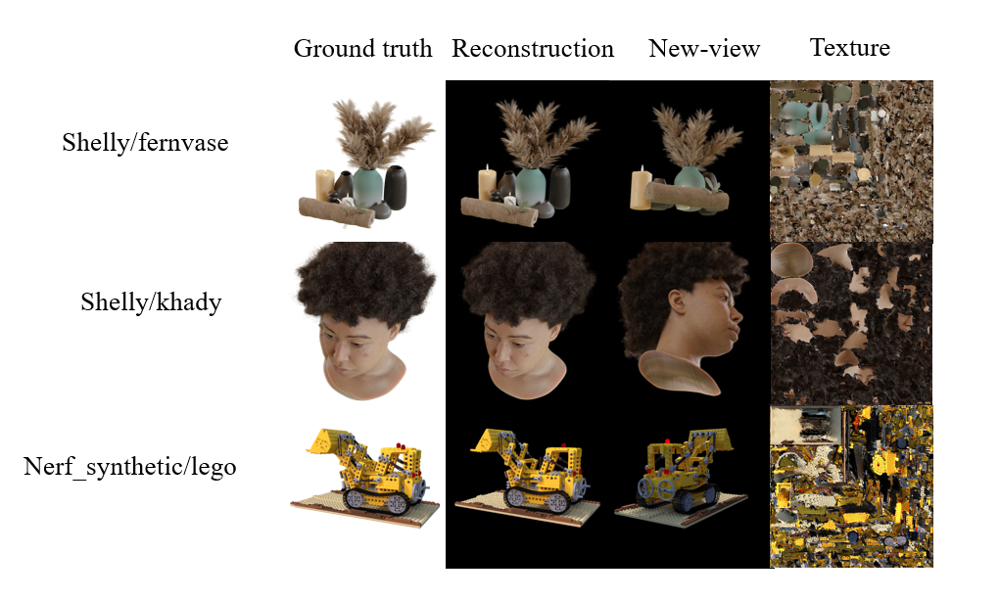

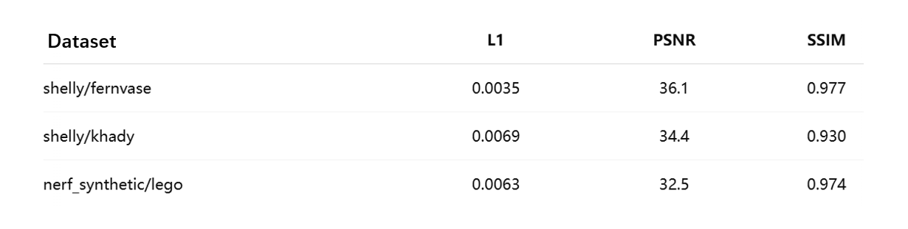

### Edition
**Texture Edition only**

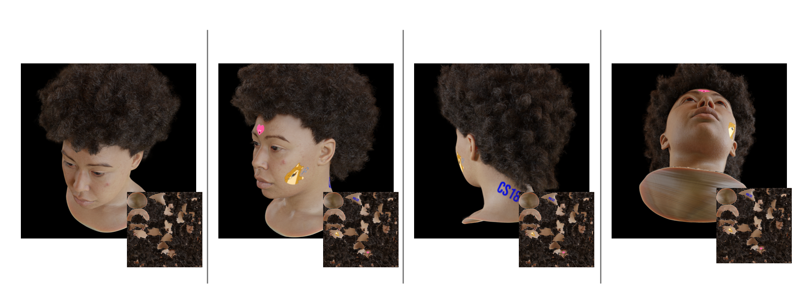

**Deformation only**

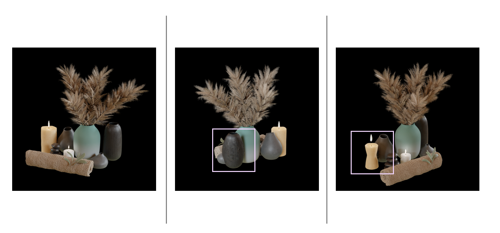

**Combined Deformation and Retexturing**

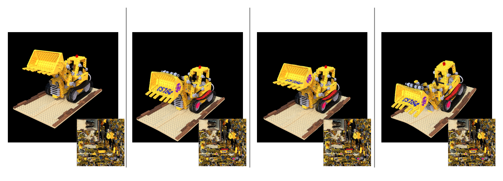

**Animation**

## Resources and References
### Papers
3D Gaussian Splatting for Real-Time Radiance Field Rendering  
  - arXiv: [2308.04079 [cs.GR]](https://doi.org/10.48550/arXiv.2308.04079)  
  
Mani-GS: Gaussian Splatting Manipulation with Triangular Mesh
  - arXiv: [2405.17811 [cs.GR]](https://doi.org/10.48550/arXiv.2405.17811)  

Mesh-based Gaussian Splatting for Real-time Large-scale Deformation
  - arXiv: [2402.04796 [cs.GR]](https://doi.org/10.48550/arXiv.2402.04796)  

### Libraries and Code
- **3D Gaussian Splatting Code:**  
  [https://github.com/graphdeco-inria/gaussian-splatting]

- **xatlas Library:**  
  [https://github.com/jpcy/xatlas]

## Contributions from each team member
### Code
The coding workload is roughly evenly distributed.

Zeyu Deng: Geometry Modeling (Mesh-to-Gaussian)\
Jack Wang: UV & Gradient Computation and Loss Design\
Zishan Wang: Square UV Texture Rendering and Extraction\
Owen Zou: Interactive Editing and Real-Time Rendering

### Documents and videos
Zishan Wang consolidated the project proposal document.

For both milestone and final phases, each contributor completed the PPT and documentation for their respective module.

Milestone deliverables were integrated by Zeyu Deng and Jack Wang; final deliverables were integrated by Zishan Wang and Owen Zou.
